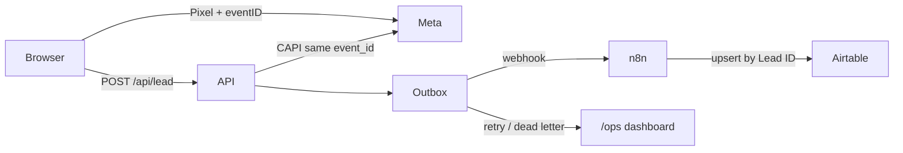

# BenefitPath qualification funnel

Take-home recreation of the [Disability Path qualification funnel](https://funnel.disabilitypath.org/qualification-v30) for the LexHive Growth Automation Engineer role.

The live original is a multi-step SSD/SSI screener that captures email + phone and fires Meta/TikTok pixels. This repo rebuilds that funnel in React, then adds the systems layer the assignment actually grades: **high-quality Meta conversions, an outbox-backed lead pipeline, and recoverable automation into Airtable via n8n**.

## What you get

- React funnel with the same branching questions, plus back navigation, ZIP for match quality, lead grading, and a matching interstitial
- Browser Pixel **and** server Conversions API with a shared `event_id` (dedup), hashed PII, `fbp`/`fbc`, IP, UA, and `external_id`
- Durable SQLite/libSQL store + outbox so Meta or n8n failures are visible and retryable
- Importable n8n workflow and Airtable schema
- `/ops?key=...` dashboard for pipeline health



## Run locally

```bash
cp .env.example .env
npm install
npm run dev
```

- Funnel: http://localhost:5173
- Ops: http://localhost:5173/ops?key=lexhive-demo (if you copied the sample `.env`)
- API: http://127.0.0.1:8787/api/health

Optional n8n:

```bash
docker compose up -d
```

Import `n8n/lead-to-airtable.json`, point Airtable credentials at a base built from `airtable/schema.md`, then set `N8N_WEBHOOK_URL` in `.env`.

## Meta event quality

| Concern | Implementation |
| --- | --- |
| Dedup | One UUID per action, Pixel `eventID` === CAPI `event_id`, unique outbox key `(channel, event_id)` |
| Matching | SHA-256 of normalized email, E.164 phone, fn/ln, ZIP, gender, country=`us`, plus unhashed `fbp`/`fbc`/IP/UA |
| Click IDs | `_fbc` cookie or `fb.1.<ts>.<fbclid>` constructed on the client and stored |
| Noise | CAPI only for `PageView`, `Lead`, `CompleteRegistration` — not every radio click |
| Test | `META_CAPI_TEST_EVENT_CODE` for Events Manager Test Events |
| Demo mode | If pixel/token are missing, events still land in the outbox as `demo` so the pipeline is reviewable |

Primary conversion is **CompleteRegistration** (name + phone + ZIP + TCPA). **Lead** fires at email so the account can optimize earlier in the funnel without double-counting, because each has its own `event_id`.

## Resilience

1. Ingest always writes the lead first.
2. Meta and n8n work is appended to `outbox` (idempotent).
3. Workers drain immediately, then on later requests.
4. Exponential backoff, dead-letter after 8 attempts.
5. `/ops` shows counts, last errors, and a Retry button.

Without n8n/Airtable credentials the local `leads` table is the structured database. Connecting the webhook does not change the funnel — it only changes the outbox destination.

## Env

See `.env.example`. Important:

- `VITE_META_PIXEL_ID` — browser Pixel
- `META_PIXEL_ID` + `META_CAPI_ACCESS_TOKEN` — CAPI
- `N8N_WEBHOOK_URL` + `N8N_WEBHOOK_SECRET`
- `OPS_KEY` — protects `/api/ops`

## Deploy

The app is a Vite static frontend plus `/api/*` serverless functions (Vercel-compatible). On Vercel, set `LIBSQL_URL` to a Turso database so the outbox survives across isolates. `/tmp` SQLite is only a fallback.

## Note for reviewers

`NOTE.md` is the one-page write-up of assumptions and trade-offs.
